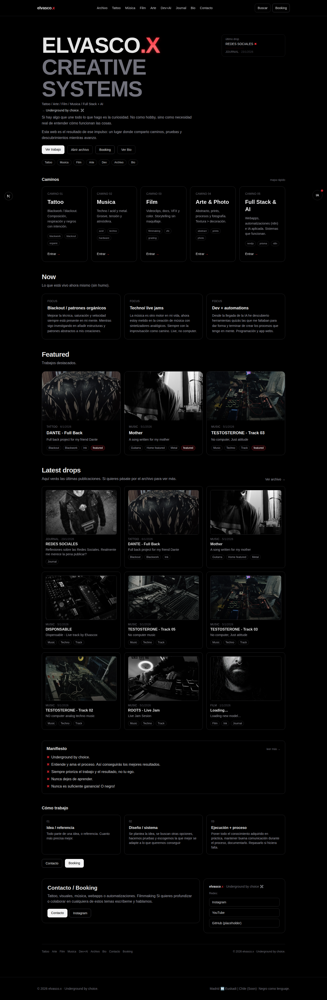
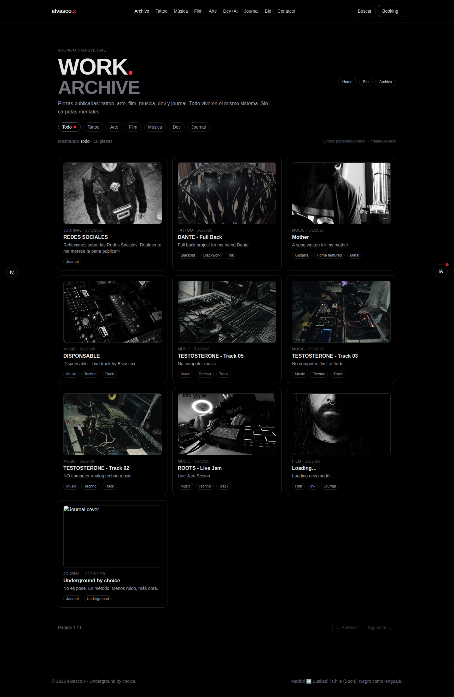
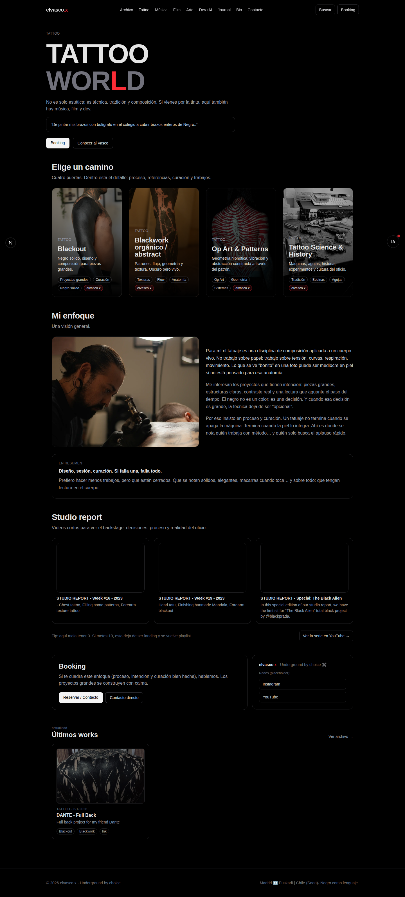
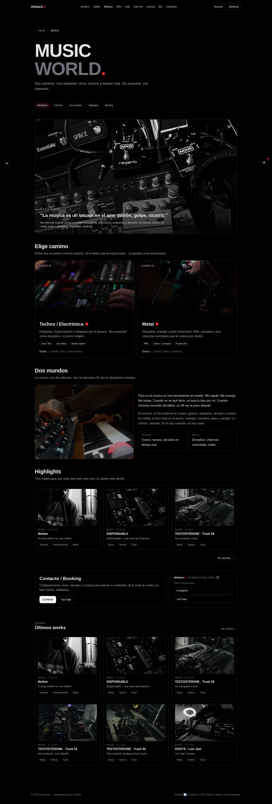
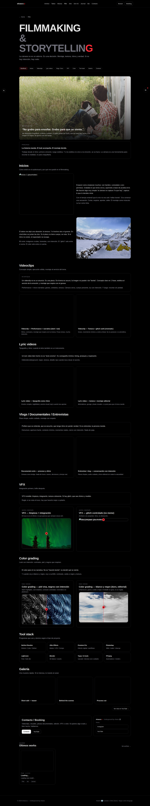
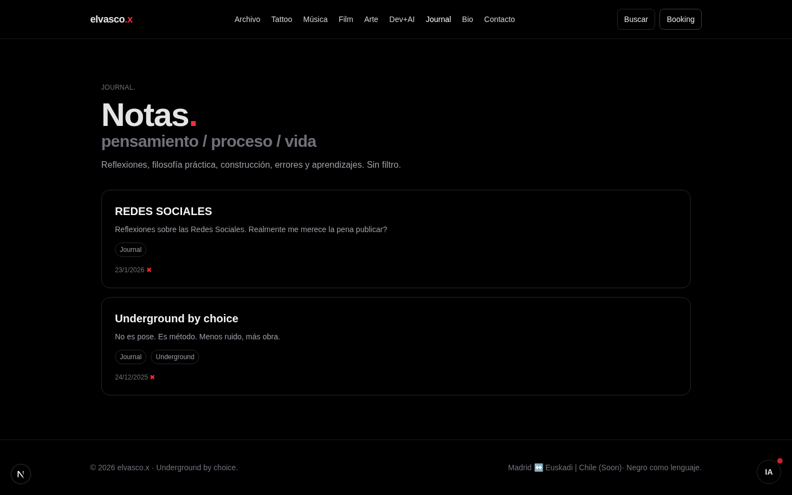
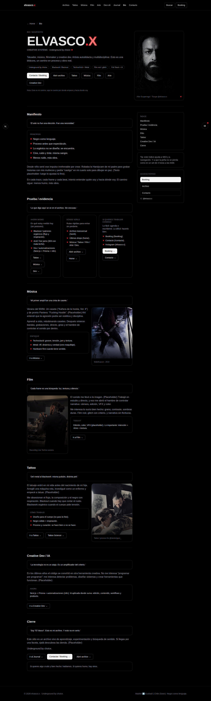
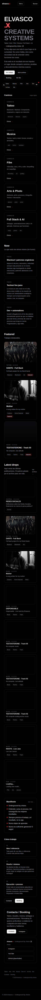
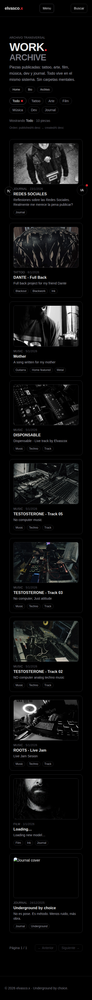

# elvascox-platform

Plataforma web fullstack para `elvascox.com`: portfolio creativo + CMS propio + API pública de solo lectura + búsqueda semántica ligera + asistente IA contextual.

Está diseñada para que también sea fácil de leer y navegar por agentes IA (LLMs), con `llms.txt`, endpoints consistentes y un índice de páginas consultable.

Producción:
- `https://www.elvascox.com/`

Versión en inglés:
- `README.en.md`

## Features clave
- Frontend con `Next.js App Router` y rutas temáticas (`/tattoo`, `/musica`, `/film`, `/arte`, `/dev`, `/journal`).
- Archivo unificado en `/work` con filtros por tipo.
- CMS privado en `/admin` (login, CRUD de `Work`, tags, media, reindex).
- API pública read-only:
  - `/api/public/meta`
  - `/api/public/works`
  - `/api/public/works/{slug}`
  - `/api/public/search`
  - `/api/public/tags`
- SEO técnico: metadata dinámica, JSON-LD, `sitemap`, `robots`, canonical.
- Capa AI-agent friendly: `llms.txt` + `SitePageIndex` para recuperación contextual.

## Tech stack
- `Next.js 16` + `React 19` + `TypeScript`
- `Prisma 6` + `PostgreSQL`
- `Tailwind CSS 4`
- `Cloudinary`
- `Vercel` (deploy + analytics)

## Quickstart (copy/paste)
```bash
npm install
cp .env.example .env

# completa DATABASE_URL / DIRECT_URL / ADMIN_PASSWORD en .env

npx prisma migrate deploy
npm run seed
npm run dev
```

## Enlaces útiles
- Web: `https://www.elvascox.com/`
- API meta: `https://www.elvascox.com/api/public/meta`
- API works: `https://www.elvascox.com/api/public/works`
- `llms.txt`: `https://www.elvascox.com/llms.txt`

## Screenshots
Regenerar:
```bash
npm run screenshots
```

Desktop (1440x900)

| Home | Work |
|---|---|
|  |  |

| Tattoo | Musica |
|---|---|
|  |  |

| Film | Journal |
|---|---|
|  |  |

| Bio |
|---|
|  |

Mobile (390x844)

| Home | Work |
|---|---|
|  |  |

## Lo que aprenderá un reclutador
- Diseño e implementación de una app fullstack end-to-end en producción.
- Modelado de contenido relacional con Prisma (`Work`, `Media`, `Tag`, `WorkTag`, `WorkLink`).
- Construcción de CMS interno con server actions, auth por cookie y flujos editoriales.
- Publicación de API read-only estable para consumo externo.
- Buenas prácticas de discoverability para IA: `llms.txt`, rutas limpias, búsqueda indexada.
- Base SEO sólida para producto real (metadata, sitemap, robots, JSON-LD).

## Documentación extendida
- `docs/SETUP.md`
- `docs/ARCHITECTURE.md`
- `docs/API_PUBLIC.md`
- `docs/DEPLOY_VERCEL.md`
- `docs/OPEN_SOURCE_CHECKLIST.md`

## Open source y CI
- Workflow de CI: `.github/workflows/ci.yml` (`npm ci`, `lint`, `build`).
- Dependabot: `.github/dependabot.yml`.
- Licencia: `LICENSE` (MIT).
- Seguridad: `SECURITY.md`.
- Contribución: `CONTRIBUTING.md`.
- Conducta: `CODE_OF_CONDUCT.md`.

## Seguridad y publicación open source
- No se versionan secretos; usa `.env.example` como referencia.
- Si un secreto entra en historial Git, se considera comprometido y debe rotarse.
- Revisa `SECURITY.md` para disclosure responsable.

## Disclaimer
Este repositorio es de demo/portfolio. No incluye datos reales de clientes ni credenciales de producción.
